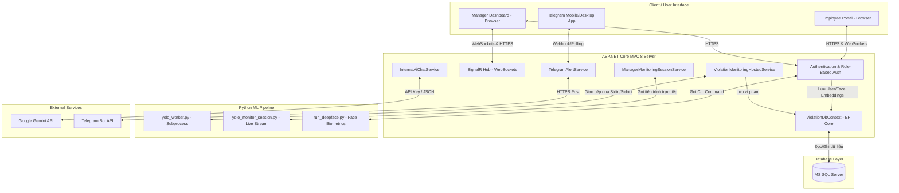
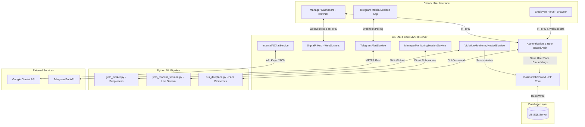

<div align="center">
  <a href="#vi-hệ-thống-giám-sát-và-quản-lý-hành-vi-vi-phạm"></a>
  <a href="#en-violation-monitoring--management-system"></a>
</div>

# [VI] HỆ THỐNG GIÁM SÁT VÀ QUẢN LÝ HÀNH VI VI PHẠM

**Tác giả (Author):** DevHP  
**Liên hệ:** bimax12052005@gmail.com  
<br/>


Hệ thống giám sát tự động tích hợp trí tuệ nhân tạo (AI) giúp phát hiện, theo dõi, cảnh báo và quản lý các hành vi vi phạm nội quy tại nơi làm việc (như hút thuốc lá, rời vị trí làm việc quá thời gian quy định). Hệ thống kết hợp sức mạnh xử lý luồng của **ASP.NET Core 8 MVC** và khả năng suy luận mô hình học sâu của **Python (YOLOv8 & DeepFace)**, đồng thời hỗ trợ cảnh báo đa kênh thời gian thực (Telegram, SignalR WebSockets) và tương tác thông minh qua **Google Gemini 2.5 Flash**.

---

## 📌 MỤC LỤC
1. [Giới Thiệu Chung](#-giới-thiệu-chung)
2. [Kiến Trúc Hệ Thống & Luồng Dữ Liệu (Architecture & Dataflow)](#-kiến-trúc-hệ-thống--luồng-dữ-liệu-architecture--dataflow)
3. [Chi Tiết Thiết Kế Kỹ Thuật AI (AI Engines & Persistent Python Worker)](#-chi-tiết-thiết-kế-kỹ-thuật-ai-ai-engines--persistent-python-worker)
4. [Các Phân Hệ Chức Năng Chính](#-các-phân-hệ-chức-năng-chính)
5. [Cơ Sở Dữ Liệu Chi Tiết (Database Schema)](#-cơ-sở-dữ-liệu-chi-tiết-database-schema)
6. [Tài Liệu REST API & Cổng Webhook](#-tài-liệu-rest-api--cổng-webhook)
7. [Hệ Thống Chat Bảo Mật & Mã Hóa AES-256](#-hệ-thống-chat-bảo-mật--mã-hóa-aes-256)
8. [Tương Tác telegram Bot & Gemini AI Assistant](#-tương-tác-telegram-bot--gemini-ai-assistant)
9. [Hướng Dẫn Cấu Hình & Vận Hành](#-hướng-dẫn-cấu-hình--vận-hành)
10. [Kiểm Thử Tích Hợp Tự Động (Integration Testing)](#-kiểm-thử-tích-hợp-tự-động-integration-testing)

---

## 📖 GIỚI THIỆU CHUNG

Tại các doanh nghiệp và tổ chức, việc đảm bảo tác phong làm việc, an toàn lao động và tuân thủ quy định đóng vai trò then chốt trong vận hành. Phương pháp giám sát truyền thống qua camera an ninh đòi hỏi con người phải túc trực 24/7, dễ gây mệt mỏi, bỏ sót vi phạm và không thể phản hồi tức thì.

**Hệ thống Giám sát và Quản lý Hành vi Vi phạm** giải quyết bài toán này bằng cách:
* **Tự động hóa giám sát**: Sử dụng mô hình **YOLOv8** tối ưu chạy cục bộ để nhận diện các lớp hành vi nhạy cảm: hút thuốc lá (`Cigarette`) và rời vị trí làm việc (`un-occupied_desk`).
* **Theo dõi liên tục (Object Tracking)**: Sử dụng thuật toán tracking dựa trên độ tương đồng không gian (IoU Bounding Box) và lớp chuẩn `person` để gán nhãn định danh cho đối tượng, tránh cảnh báo giả.
* **Cảnh báo tức thời (Instant Alerts)**: Gửi tin nhắn và ảnh chụp bằng chứng trực tiếp tới kênh Telegram của Quản lý và cập nhật ngay lên Dashboard thông qua kết nối SignalR WebSockets.
* **Hỗ trợ thông minh**: Nhân viên và Quản lý có thể trò chuyện trực tiếp với Trợ lý AI tích hợp **Gemini 2.5 Flash** để tra cứu nhanh lịch sử vi phạm, quy chế nội bộ hoặc thông tin tài khoản cá nhân.
* **Bảo mật tối đa**: Tin nhắn trao đổi nội bộ được mã hóa đối xứng AES-256 trước khi lưu xuống database SQL Server.

---

## 🏗️ KIẾN TRÚC HỆ THỐNG & LUỒNG DỮ LIỆU (ARCHITECTURE & DATAFLOW)

Hệ thống được thiết kế theo kiến trúc **Client-Server lai hướng dịch vụ (Hybrid Subprocess-Worker Architecture)** nhằm tối ưu hóa tài nguyên giữa ứng dụng Web ASP.NET Core (hiệu năng cao, chịu tải tốt) và các thư viện Machine Learning của Python (yêu cầu phần cứng GPU/CPU và tài nguyên lớn).

### 1. Sơ đồ Kiến trúc Tổng quan (Mermaid Diagram)



---

### 2. Hai Luồng Xử lý AI Giám sát Song song

Hệ thống cung cấp hai chế độ chạy riêng biệt để cân bằng giữa hiệu suất thời gian thực và ghi nhận dữ liệu:

#### A. Luồng Giám sát Nền Tự động (Background Hosted Service)
* **Dịch vụ điều phối**: [ViolationMonitoringHostedService](file:///D:/WEB/project/Webapp_Quan_Li_Hanh_Vi_Vi_Pham/Services/Monitoring/ViolationMonitoringHostedService.cs) chạy liên tục dưới dạng Background Service của ASP.NET Core.
* **Chu kỳ quét**: Mỗi 5 giây một lần, dịch vụ thực hiện chụp một chuỗi frame ảnh từ camera mặc định được cấu hình trong `appsettings.json`.
* **suy luận**: Gửi ảnh tới **Persistent Python Worker** để chạy mô hình YOLOv8 phát hiện hành vi.
* **Ghi nhận & Cảnh báo**: Nếu hành vi vi phạm vượt quá thời gian tích lũy cho phép (Hút thuốc > 1.5s, Rời vị trí > 3s), ảnh bằng chứng sẽ được lưu vào đĩa cứng tại thư mục `wwwroot/uploads/violations/`, đồng thời ghi một bản ghi vi phạm mới vào database với trạng thái `Pending`. Ngay lập tức, `TelegramAlertService` được kích hoạt gửi ảnh và nội dung cảnh báo về Telegram của Manager. Giao diện Manager Dashboard cũng sẽ tự động cập nhật danh sách vi phạm qua SignalR.

#### B. Luồng Giám sát Trực tiếp (Manager Live Preview Session)
* **Kích hoạt**: Khi Manager chuyển sang Tab "Giám sát trực tiếp" trên giao diện Web.
* **Điều phối**: [ManagerMonitoringSessionService](file:///D:/WEB/project/Webapp_Quan_Li_Hanh_Vi_Vi_Pham/Services/Monitoring/ManagerMonitoringSessionService.cs) sẽ khởi động một tiến trình độc lập thực thi script Python [yolo_monitor_session.py](file:///D:/WEB/project/Webapp_Quan_Li_Hanh_Vi_Vi_Pham/ML/scripts/yolo_monitor_session.py).
* **Hiệu suất**: Script chạy xử lý thời gian thực ở tốc độ cao (~6 FPS), stream trực tiếp luồng hình ảnh camera đã được vẽ sẵn khung Bounding Box và Tracking ID lên màn hình web của Manager thông qua kết nối SignalR Hub.
* **Lưu ý**: Chế độ này chỉ hiển thị trực quan (Visual Preview), **hoàn toàn không ghi đè dữ liệu rác vào Database hay spam thông báo về kênh Telegram**, giúp hệ thống vận hành tối ưu nhất.

---

## 🧠 CHI TIẾT THIẾT KẾ KỸ THUẬT AI (AI ENGINES & PERSISTENT PYTHON WORKER)

### 1. Kiến trúc Persistent Python Worker (Tối ưu hóa độ trễ)
Một trong những điểm nghẽn lớn nhất khi gọi mã Python từ C# là độ trễ tải thư viện (như `torch`, `ultralytics`, `opencv`) và nạp file trọng số mô hình (.pt) vào RAM/VRAM, thường mất từ 3-5 giây cho mỗi lần gọi riêng lẻ.

Hệ thống giải quyết triệt để vấn đề này bằng mô hình **Persistent Python Worker Client**:
* Khi ứng dụng Web khởi động, lớp [YoloPythonWorkerClient](file:///D:/WEB/project/Webapp_Quan_Li_Hanh_Vi_Vi_Pham/ML/Inference/YoloPythonWorkerClient.cs) sẽ khởi chạy tiến trình [yolo_worker.py](file:///D:/WEB/project/Webapp_Quan_Li_Hanh_Vi_Vi_Pham/ML/scripts/yolo_worker.py) một lần duy nhất và duy trì tiến trình đó chạy ẩn (Daemon Process).
* Tiến trình Python sẽ tải sẵn toàn bộ thư viện cần thiết và nạp sẵn file trọng số mô hình YOLOv8 (`weights/best.pt`).
* Khi có yêu cầu phân tích ảnh, C# sẽ truyền dữ liệu yêu cầu dưới định dạng JSON qua luồng nhập chuẩn (`stdin`) của tiến trình Python và đọc trực tiếp kết quả JSON trả về từ luồng xuất chuẩn (`stdout`).
* **Kết quả**: Giảm độ trễ suy luận từ ~4000ms xuống chỉ còn **~30ms - 80ms** mỗi frame, giúp hệ thống hoạt động trơn tru.

---

### 2. Thuật toán Object Tracking & Phát hiện Vi phạm
Hệ thống sử dụng cơ chế liên kết không gian (Spatial Association) để theo dõi các đối tượng qua các khung hình liên tiếp:
* **Gán nhãn định danh (Tracking ID)**: Lớp đối tượng `person` được sử dụng làm chuẩn định vị. Mỗi người phát hiện được gán một Bounding Box `[x1, y1, x2, y2]`.
* **Tính toán IoU (Intersection over Union)**: Giữa hai khung hình liên tiếp, hệ thống tính toán ma trận IoU giữa các bounding box cũ và mới. Nếu mức độ trùng khớp vượt ngưỡng cấu hình `TrackMatchIouThreshold` (mặc định `0.4`), đối tượng mới sẽ kế thừa `TrackingId` từ đối tượng cũ.
* **Bộ lọc tích lũy thời gian vi phạm**:
  * **Hút thuốc**:
    $$t_{smoke} > 1.5 \text{ giây}$$
    Khi phát hiện đối tượng lá thuốc (`Cigarette`) nằm trong/gần vùng bao của một `person` có cùng `TrackingId` liên tục quá 1.5 giây, hệ thống tự động chụp lại và cảnh báo.
  * **Rời vị trí làm việc**:
    $$t_{empty} > 3.0 \text{ giây}$$
    Tại vùng tọa độ làm việc được xác định, nếu lớp ghế trống (`un-occupied_desk`) xuất hiện liên tục quá 3 giây (đồng nghĩa không có lớp `person` tương ứng làm việc), hệ thống tự động ghi nhận vi phạm.

---

### 3. Xác thực Sinh trắc học Khuôn mặt (DeepFace Engine)
Sử dụng thư viện **DeepFace** chạy trên nền mô hình **VGG-Face** hoặc **RetinaFace** để cung cấp khả năng xác thực không dùng mật khẩu.
* **Đăng ký tài khoản (Enrollment)**: Nhân viên cung cấp 4 ảnh được chụp từ webcam tương ứng với 4 góc độ mặt (0: Trực diện, 1: Nghiêng trái, 2: Nghiêng phải, 3: Cúi/Ngửa). Script [run_deepface.py](file:///D:/WEB/project/Webapp_Quan_Li_Hanh_Vi_Vi_Pham/ML/scripts/run_deepface.py) sẽ trích xuất 4 vector đặc trưng (Embeddings - mảng float 128 hoặc 4096 chiều) và lưu trực tiếp vào bảng `UserFaceEmbeddings`.
* **Xác thực Đăng nhập (Verification)**: Khi nhân viên thực hiện điểm danh hoặc đăng nhập bằng camera, ảnh hiện tại được so sánh với tất cả các vector mẫu trong database của tài khoản đó bằng phép đo **Cosine Similarity**:
  $$\text{Cosine Distance} = 1 - \frac{\mathbf{A} \cdot \mathbf{B}}{\|\mathbf{A}\| \|\mathbf{B}\|}$$
  Nếu khoảng cách nhỏ hơn hoặc bằng ngưỡng thiết lập (được cấu hình động trong DB từ `0.40` đến `0.68`), tài khoản sẽ được đăng nhập hợp lệ.

---

## 🎯 CÁC PHÂN HỆ CHỨC NĂNG CHÍNH

### 1. Phân hệ Quản lý Vi phạm (Violation Management)
* **Bảng điều khiển thống kê (Dashboard Charts)**: Cung cấp biểu đồ trực quan về xu hướng vi phạm theo thời gian, tỷ lệ các loại lỗi vi phạm hành vi để ban quản lý có cái nhìn tổng quan về tác phong làm việc.
* **Duyệt vi phạm tự động/bằng tay**: Quản lý có thể xem chi tiết hình ảnh bằng chứng, thời gian ghi nhận và đưa ra quyết định duyệt phạt (`Approved`) hoặc bác bỏ (`Rejected`) nếu đó là lỗi nhận diện giả của AI.

### 2. Phân hệ Nhân sự & Tính lương (HR & Payroll Control)
* **Đăng ký / Kích hoạt tài khoản**: Đăng ký nhân viên mới qua webcam hoặc qua Google OAuth. Manager có quyền phê duyệt kích hoạt tài khoản thông qua khóa kích hoạt (`ManagerKey`).
* **Quản lý ca làm việc (Work Sessions)**: Điểm danh đầu ca và cuối ca bằng camera nhận diện khuôn mặt. Ghi nhận thời gian đi muộn, về sớm.
* **Quản lý đơn từ (Approval Requests)**: Tạo và duyệt đơn xin nghỉ phép, giải trình vi phạm hoặc cử đi công tác.
* **Tính toán bảng lương tự động**: Hệ thống tổng hợp ngày công từ bảng ca làm việc, sau đó tự động thực hiện khấu trừ tiền lương dựa trên số lần vi phạm đã bị duyệt phạt trong tháng theo định mức của công ty.

### 3. Phòng chat Nội bộ bảo mật (Secure Chat Room)
* Hỗ trợ trò chuyện nhắn tin thời gian thực giữa Manager - Employee và Employee - Employee.
* Sử dụng kết nối SignalR WebSockets bảo mật cao.

### 4. Trợ lý AI Gemini hỗ trợ tra cứu
* Tích hợp chatbot hỗ trợ trực tiếp từ mô hình Gemini 2.5 Flash.
* Phân quyền truy xuất ngữ cảnh (Role-based Context retrieval) đảm bảo tính bảo mật nội bộ của doanh nghiệp.

---

## 🗄️ CƠ SỞ DỮ LIỆU CHI TIẾT (DATABASE SCHEMA)

Cơ sở dữ liệu được ánh xạ và quản lý thông qua lớp [ViolationDbContext](file:///D:/WEB/project/Webapp_Quan_Li_Hanh_Vi_Vi_Pham/Models/Entities/ViolationDbContext.cs). Dưới đây là mô tả chi tiết sơ đồ các bảng:

### 1. Bảng `Users` (Người dùng hệ thống)
| Tên Trường | Kiểu Dữ Liệu | Ràng buộc / Thuộc tính | Mô tả |
| :--- | :--- | :--- | :--- |
| **Id** | uniqueidentifier | Primary Key | Định danh duy nhất người dùng. |
| **Username** | nvarchar(450) | Unique Index, Required | Tên tài khoản hoặc Email (đối với Google Auth). |
| **PasswordHash**| nvarchar(max) | Required | Mật khẩu tài khoản đã được băm (BCrypt). |
| **FullName** | nvarchar(max) | Required | Họ và tên đầy đủ của người dùng. |
| **Role** | nvarchar(max) | Required | Vai trò tài khoản (`Admin`, `Manager`, `Employee`). |
| **EmployeeCode**| nvarchar(max) | - | Mã định danh nhân viên (dùng tính lương, vi phạm). |
| **FaceImagePath**| nvarchar(max) | - | Đường dẫn file ảnh đăng ký khuôn mặt trên Server. |
| **ManagerKey**  | nvarchar(max) | - | Mã khóa kích hoạt do Manager cung cấp. |
| **IsKeyActivated**| bit | Default: 1 | Trạng thái tài khoản đã kích hoạt. |
| **CreatedAtUtc**| datetime2 | Required | Thời điểm khởi tạo tài khoản. |

### 2. Bảng `UserFaceEmbeddings` (Đặc trưng khuôn mặt sinh trắc học)
| Tên Trường | Kiểu Dữ Liệu | Ràng buộc / Thuộc tính | Mô tả |
| :--- | :--- | :--- | :--- |
| **Id** | uniqueidentifier | Primary Key | Định danh duy nhất bản ghi đặc trưng. |
| **UserId** | uniqueidentifier | Foreign Key -> `Users(Id)` | Khóa ngoại liên kết tới tài khoản người dùng. |
| **EmbeddingJson**| nvarchar(max) | Required | Chuỗi JSON lưu trữ vector đặc trưng (128/4096 chiều). |
| **FaceAngleIndex**| int | Range: 0 - 3 | Chỉ số góc mặt (0: Trực diện, 1: Trái, 2: Phải, 3: Cúi). |
| **CreatedAtUtc**| datetime2 | Required | Thời điểm trích xuất vector. |

### 3. Bảng `ViolationRecords` (Bản ghi vi phạm hành vi)
| Tên Trường | Kiểu Dữ Liệu | Ràng buộc / Thuộc tính | Mô tả |
| :--- | :--- | :--- | :--- |
| **Id** | uniqueidentifier | Primary Key | Định danh duy nhất ca vi phạm. |
| **TrackingId** | nvarchar(max) | Required | Mã định danh sinh ra từ thuật toán tracking AI. |
| **EmployeeCode**| nvarchar(max) | - | Mã nhân viên vi phạm (nếu đã xác thực được). |
| **EmployeeName**| nvarchar(max) | - | Tên nhân viên vi phạm hoặc "Hệ thống giám sát". |
| **ViolationType**| nvarchar(max) | - | Loại vi phạm (`Hút thuốc`, `Rời vị trí làm việc`). |
| **Severity** | nvarchar(max) | - | Mức độ nghiêm trọng (`High`, `Medium`, `Low`). |
| **DetectedAtUtc**| datetime2 | Required | Thời điểm AI phát hiện vi phạm. |
| **CameraLocation**| nvarchar(max) | - | Vị trí lắp đặt camera giám sát. |
| **EvidenceUrl** | nvarchar(max) | Required | Đường dẫn tới ảnh chụp bằng chứng vi phạm. |
| **Status** | nvarchar(max) | Default: `Pending` | Trạng thái xử lý vi phạm (`Pending`, `Approved`, `Rejected`). |
| **TelegramSent**| bit | - | Đánh dấu đã gửi cảnh báo tin nhắn Telegram. |
| **TelegramPhotoSent**| bit | - | Đánh dấu đã gửi ảnh bằng chứng qua Telegram. |
| **TelegramSentAtUtc**| datetime2 | Nullable | Thời điểm gửi Telegram thành công. |
| **TelegramTargetChatIds**| nvarchar(max) | Nullable | Danh sách các Chat ID Telegram đã nhận cảnh báo. |
| **TelegramLastError**| nvarchar(max) | Nullable | Thông tin lỗi gửi Telegram gần nhất nếu có. |
| **ReviewedBy** | nvarchar(max) | Nullable | Tên quản lý đã thực hiện duyệt vi phạm. |
| **ReviewedAtUtc**| datetime2 | Nullable | Thời điểm thực hiện duyệt vi phạm. |
| **ReviewNote** | nvarchar(max) | Nullable | Lý do giải trình/khiếu nại từ nhân viên. |

### 4. Bảng `EmployeeMessages` (Tin nhắn phòng chat nội bộ)
| Tên Trường | Kiểu Dữ Liệu | Ràng buộc / Thuộc tính | Mô tả |
| :--- | :--- | :--- | :--- |
| **Id** | uniqueidentifier | Primary Key | Định danh duy nhất tin nhắn. |
| **SenderUsername**| nvarchar(max) | Required | Username người gửi tin nhắn. |
| **ReceiverUsername**| nvarchar(max) | Required | Username người nhận tin nhắn. |
| **Content** | nvarchar(max) | **Encrypted (AES-256)** | Nội dung tin nhắn chat (được tự động mã hóa). |
| **Timestamp** | datetime2 | Required | Thời điểm gửi tin nhắn. |
| **IsRead** | bit | Default: 0 | Trạng thái tin nhắn đã đọc hay chưa. |

---

## 🔌 TÀI LIỆU REST API & CỔNG WEBHOOK

Hệ thống cung cấp một số API công khai hỗ trợ tích hợp với các hệ thống ngoại vi (như các thiết bị Camera AI thông minh bên ngoài hoặc ứng dụng Mobile).

### 1. API Lấy thông tin hệ thống cơ bản
* **Endpoint**: `GET /api/public/info`
* **Mô tả**: Lấy trạng thái hoạt động của hệ thống.
* **Phản hồi mẫu (JSON)**:
  ```json
  {
    "app": "Hệ thống Quản lý Hành vi",
    "version": "1.0",
    "status": "Online"
  }
  ```

### 2. API Lấy danh sách nhân viên hợp lệ
* **Endpoint**: `GET /api/public/employees`
* **Mô tả**: Trả về danh sách nhân viên đã cấu hình sinh trắc học khuôn mặt.
* **Phản hồi mẫu (JSON)**:
  ```json
  {
    "success": true,
    "data": [
      {
        "id": "c869fb04-58e1-455b-bf76-c2cf9bb0220d",
        "username": "hieubienhoa",
        "fullName": "Nguyễn Ngọc Hiếu",
        "role": "Employee"
      }
    ]
  }
  ```

### 3. Cổng nhận Cảnh báo Vi phạm tức thời (Instant Alert Webhook)
API hỗ trợ các camera thông minh tích hợp AI bên ngoài đẩy dữ liệu cảnh báo vi phạm trực tiếp về hệ thống trung tâm để duyệt và gửi Telegram.
* **Endpoint**: `POST /api/monitoring/instant-alert`
* **Headers bắt buộc**: `X-Monitoring-Key: <Cấu hình ApiKey trong appsettings.json>`
* **Cấu trúc dữ liệu gửi lên (JSON)**:
  ```json
  {
    "ruleType": "smoke", // hoặc "empty_desk"
    "label": "Cigarette",
    "trackId": "SMK-9988",
    "durationSeconds": 2.5,
    "cameraLocation": "Cổng phụ số 2",
    "snapshotBase64": "iVBORw0KGgoAAAANSUhEUgAAAAEAAAABCA...", // Ảnh chụp bằng chứng dạng Base64
    "snapshotMimeType": "image/jpeg"
  }
  ```
* **Phản hồi mẫu**:
  ```json
  {
    "success": true,
    "violationId": "a90098df-8924-4f81-ba55-081cb9f2a7db",
    "trackId": "SMK-9988",
    "violationType": "Hút thuốc tại khu vực làm việc",
    "severity": "High",
    "detectedAtUtc": "2026-06-17T12:26:28Z",
    "telegramAttempted": true
  }
  ```

---

## 🔒 HỆ THỐNG CHAT BẢO MẬT & MÃ HÓA AES-256

Để bảo vệ quyền riêng tư cá nhân và thông tin trao đổi nội bộ, hệ thống áp dụng cơ chế mã hóa đối xứng AES-256 bảo mật cao trên lớp dữ liệu thông qua lớp hỗ trợ [EncryptionHelper](file:///D:/WEB/project/Webapp_Quan_Li_Hanh_Vi_Vi_Pham/Helpers/EncryptionHelper.cs):

### 1. Cơ chế hoạt động
* **Khóa mã hóa**: Được định nghĩa bảo mật tại `"Encryption:MessageKey"` trong cấu hình.
* **Quy trình lưu trữ**:
  1. Khi người dùng gửi tin nhắn trên giao diện chat (thông qua SignalR Hub [InternalChatHub](file:///D:/WEB/project/Webapp_Quan_Li_Hanh_Vi_Vi_Pham/Hubs/InternalChatHub.cs)).
  2. Tin nhắn được chuyển tới DbContext.
  3. Lớp chuyển đổi dữ liệu của EF Core `ValueConverter` thực hiện chặn chuỗi ký tự, mã hóa AES-256 và chuyển thành chuỗi Base64 trước khi ghi vào đĩa của SQL Server.
  4. Khi truy vấn đọc tin nhắn, cơ chế tự động giải mã chuỗi Base64 thành nội dung gốc để truyền tải lên giao diện người dùng.
* **Minh họa cấu trúc dữ liệu lưu trong SQL Server**:
  ```sql
  -- Tin nhắn gốc: "Hôm nay tôi xin phép đi muộn 15 phút"
  -- Dữ liệu thực tế lưu trong cột Content của bảng EmployeeMessages:
  "U2FsdGVkX19q7Yv3X2r+oJ1Z5k9t8Yp5X1w5q6z7X8c3u2..."
  ```

---

## 🤖 TƯƠNG TÁC TELEGRAM BOT & GEMINI AI ASSISTANT

### 1. Kênh tương tác Telegram Bot đa hướng
Hệ thống sử dụng [TelegramCommandPollingHostedService](file:///D:/WEB/project/Webapp_Quan_Li_Hanh_Vi_Vi_Pham/Services/Notifications/TelegramCommandPollingHostedService.cs) để quét định kỳ tin nhắn gửi tới Bot và thực thi các câu lệnh tương tác của Manager:

```
                  ┌───────────────────────────────┐
                  │ Quản lý gửi tin nhắn tới Bot  │
                  └──────────────┬────────────────┘
                                 │
                   ┌─────────────┼─────────────┐
                   ▼ (/status)   ▼ (/history)  ▼ (/help)
           ┌──────────────┐┌──────────────┐┌──────────────┐
           │ Kiểm tra hệ  ││ Lấy danh     ││ Hiển thị     │
           │ thống giám   ││ sách 5 vi    ││ hướng dẫn    │
           │ sát AI       ││ phạm gần     ││ sử dụng câu  │
           │              ││ nhất         ││ lệnh         │
           └──────┬───────┘└──────┬───────┘└──────┬───────┘
                  │               │               │
                  └───────────────┼───────────────┘
                                  ▼
                     Bot phản hồi kết quả trực
                     tiếp về đoạn chat Telegram
```

---

### 2. Trợ lý Trí tuệ Nhân tạo Gemini Chat
Trợ lý tích hợp mô hình **Gemini 2.5 Flash** hoạt động như một chuyên viên giải đáp nội bộ thông minh:
* **Prompt thiết kế (System Instruction)**:
  ```
  Bạn là trợ lý AI nội bộ của hệ thống quản lý hành vi vi phạm.
  Chỉ được phép trả lời dựa trên phần CONTEXT được cung cấp trong yêu cầu này.
  Quy tắc bắt buộc:
  - Không được trả lời kiến thức ngoài hệ thống.
  - Không suy đoán nếu CONTEXT không có dữ liệu.
  - Nếu câu hỏi ngoài phạm vi hoặc CONTEXT không đủ, trả lời ngắn: "Tôi chỉ có thể hỗ trợ thông tin vi phạm và thông tin nội bộ tài khoản trong hệ thống."
  ```
* **Phân quyền dữ liệu**:
  * Nếu người hỏi có vai trò `Employee`, hệ thống chỉ truy xuất lịch sử vi phạm của chính nhân viên đó để làm ngữ cảnh `CONTEXT`.
  * Nếu người hỏi là `Manager`, hệ thống sẽ truy xuất tổng quan thống kê vi phạm toàn văn phòng hôm nay, danh sách các ca vi phạm đang chờ xử lý để hỗ trợ đưa ra quyết định nhanh chóng.

---

## ⚙️ HƯỚNG DẪN CẤU HÌNH & VẬN HÀNH

### 1. Yêu cầu môi trường chạy
* Cài đặt **.NET 8.0 SDK** và **SQL Server**.
* Cài đặt **Python 3.10** hoặc **3.11** (Lưu ý: phải tích hợp Python vào biến môi trường hệ thống `PATH` để có thể gọi lệnh `python`).

### 2. Cài đặt các thư viện Python
Hệ thống có cơ chế tự động kiểm tra và chạy script PowerShell [setup_env.ps1](file:///D:/WEB/project/Webapp_Quan_Li_Hanh_Vi_Vi_Pham/setup_env.ps1) khi khởi động Web App để cài đặt môi trường ảo `.venv`. 
Nếu bạn muốn cấu hình thủ công bằng dòng lệnh:
```bash
# Di chuyển vào thư mục ML và cài đặt các thư viện phụ thuộc
cd ML
python -m venv .venv
.venv\Scripts\activate
pip install -r requirements.txt
```

### 3. Cập nhật Cơ sở dữ liệu (Database Migration)
Mở cửa sổ dòng lệnh tại thư mục gốc của dự án và chạy các lệnh sau để tự động tạo cấu trúc bảng trong SQL Server:
```bash
dotnet ef database update
```
*(Nếu chưa cài đặt công cụ dotnet ef, vui lòng cài đặt qua lệnh: `dotnet tool install --global dotnet-ef`)*.

### 4. Chạy Ứng dụng
Khởi chạy dự án ở chế độ phát triển:
```bash
dotnet run
```
Sau khi khởi chạy thành công, trình duyệt sẽ mở tại địa chỉ mặc định `https://localhost:7192`. Hệ thống sẽ tự động gọi [DbSeeder](file:///D:/WEB/project/Webapp_Quan_Li_Hanh_Vi_Vi_Pham/Services/DbSeeder.cs) để khởi tạo các tài khoản quản trị viên và nhân viên mẫu ban đầu.

---

## 🧪 KIỂM THỬ TÍCH HỢP TỰ ĐỘNG (INTEGRATION TESTING)

Hệ thống được tích hợp sẵn 2 chế độ kiểm thử tự động trực tiếp từ dòng lệnh giúp các lập trình viên dễ dàng rà soát và kiểm tra toàn diện hoạt động của các phân hệ AI và kết nối API bên ngoài mà không cần chạy trình duyệt web.

### 1. Kiểm thử Sinh trắc học Khuôn mặt (Biometrics Verification Tests)
Chạy lệnh sau để kiểm tra tích hợp DeepFace, tạo embeddings khuôn mặt, so khớp và kiểm thử hành vi thay đổi ngưỡng (threshold) lưu trong DB:
```bash
dotnet run -- --test-biometrics
```
**Danh sách các ca kiểm thử tự động được thực hiện:**
* **Testcase 1**: Đăng ký tài khoản nhân viên với đủ 4 ảnh khuôn mặt hợp lệ (Kết quả mong đợi: Lưu cơ sở dữ liệu thành công và tạo đủ 4 bản ghi embeddings đặc trưng khuôn mặt).
* **Testcase 2**: Đăng ký thiếu số lượng ảnh tối thiểu (3 ảnh thay vì 4) (Kết quả mong đợi: Hệ thống chặn và ném lỗi `InvalidOperationException`).
* **Testcase 3**: Đăng ký với ảnh bị mờ hoặc không phát hiện thấy khuôn mặt (Kết quả mong đợi: Mô hình DeepFace phát hiện lỗi và từ chối đăng ký).
* **Testcase 4**: Đăng nhập đúng người đã đăng ký (Kết quả mong đợi: So khớp thành công, trả về đăng nhập hợp lệ).
* **Testcase 5**: Đăng nhập sai người (Kết quả mong đợi: Khoảng cách Cosine Distance vượt ngưỡng, hệ thống từ chối xác thực đăng nhập).
* **Testcase 6**: Đăng nhập với ảnh quá mờ/quá tối (Kết quả mong đợi: Từ chối xác thực vì không đủ độ tin cậy khuôn mặt).
* **Testcase 7**: Tự động hóa cấu hình ngưỡng khoảng cách (Threshold Debugging) (Kết quả mong đợi: Thay đổi động tham số `ConfThreshold` trong DB từ `0.40` lên `0.68` giúp cho ảnh có độ sáng lệch nhẹ vượt qua xác thực thành công).

### 2. Kiểm thử Mô phỏng Vi phạm & Telegram Alerts (Monitoring Tests)
Chạy lệnh sau để giả lập các sự kiện vi phạm thời gian thực và kiểm tra kết nối với Bot Telegram:
```bash
dotnet run -- --test-monitoring
```
**Danh sách các ca kiểm thử tự động được thực hiện:**
* **Testcase Hút thuốc**: Giả lập phát hiện thuốc lá (`Cigarette`) vượt ngưỡng thời gian tích lũy tại khu vực làm việc (Kết quả mong đợi: Tạo hồ sơ vi phạm mới trong database, ghi nhận Audit Log và gửi thông báo cảnh báo kèm ảnh bằng chứng về Telegram Chat ID đã cấu hình).
* **Testcase Rời vị trí**: Giả lập nhân viên rời bàn làm việc trống (`un-occupied_desk`) quá thời gian tối đa (Kết quả mong đợi: Tạo bản ghi vi phạm mới, ghi nhận Audit Log và gửi thông báo cảnh báo về Telegram Chat ID).
* **Telegram Commands Poll**: Gọi dịch vụ quét và lấy danh sách các tin nhắn lệnh gần nhất gửi tới Bot Telegram, xử lý các lệnh như `/status` và `/history`.


<br/><hr/><br/>

# [EN] VIOLATION MONITORING & MANAGEMENT SYSTEM

**Author:** DevHP  
**Contact:** bimax12052005@gmail.com  
<br/>

An automated monitoring system integrated with Artificial Intelligence (AI) that detects, tracks, alerts, and manages workplace rule violations (such as smoking, leaving the workstation). The system combines the stream processing power of **ASP.NET Core 8 MVC** and the deep learning inference capabilities of **Python (YOLOv8 & DeepFace)**, while supporting real-time multi-channel alerts (Telegram, SignalR WebSockets) and intelligent interaction via **Google Gemini 2.5 Flash**.

---

## 📌 TABLE OF CONTENTS
1. [General Introduction](#-general-introduction)
2. [Architecture & Dataflow](#-architecture--dataflow)
3. [AI Engines & Persistent Python Worker Details](#-ai-engines--persistent-python-worker-details)
4. [Main Functional Modules](#-main-functional-modules)
5. [Database Schema](#-database-schema)
6. [REST API & Webhook Documents](#-rest-api--webhook-documents)
7. [Secure Chat System & AES-256 Encryption](#-secure-chat-system--aes-256-encryption)
8. [Telegram Bot & Gemini AI Assistant Interaction](#-telegram-bot--gemini-ai-assistant-interaction)
9. [Configuration & Operation Guide](#-configuration--operation-guide)
10. [Automated Integration Testing](#-automated-integration-testing)

---

## 📖 GENERAL INTRODUCTION

In businesses and organizations, ensuring proper workplace conduct, safety, and compliance is crucial for operations. Traditional monitoring methods via security cameras require 24/7 human supervision, leading to fatigue, missed violations, and lack of instant feedback.

The **Violation Monitoring & Management System** solves this problem by:
* **Automated Monitoring**: Using an optimized **YOLOv8** model running locally to detect sensitive behavior classes: smoking (`Cigarette`) and leaving the workstation (`un-occupied_desk`).
* **Continuous Tracking**: Utilizing tracking algorithms based on spatial similarity (IoU Bounding Box) and the `person` class to assign IDs, preventing false alerts.
* **Instant Alerts**: Sending evidence images and alerts directly to the Manager's Telegram channel and updating the Dashboard instantly via SignalR WebSockets.
* **Smart Support**: Employees and Managers can chat directly with the built-in AI Assistant (**Gemini 2.5 Flash**) to quickly look up violation history, internal rules, or account details.
* **Maximum Security**: Internal chat messages are symmetrically encrypted with AES-256 before being saved to the SQL Server database.

---

## 🏗️ ARCHITECTURE & DATAFLOW

The system is designed with a **Hybrid Subprocess-Worker Architecture** to optimize resources between the ASP.NET Core Web application (high performance, good load balancing) and Python Machine Learning libraries (requiring heavy GPU/CPU resources).

### 1. Overall Architecture Diagram (Mermaid)



---

## 🧠 AI ENGINES & PERSISTENT PYTHON WORKER DETAILS

### 1. Persistent Python Worker Architecture (Latency Optimization)
A major bottleneck when calling Python code from C# is the latency of loading libraries (`torch`, `ultralytics`, `opencv`) and the model weights into RAM/VRAM, often taking 3-5 seconds per call.

The system solves this entirely with a **Persistent Python Worker Client**:
* The C# application launches the `yolo_worker.py` process once and keeps it running as a Daemon Process.
* The Python process pre-loads all libraries and the YOLOv8 model.
* C# sends JSON requests via `stdin` and reads JSON responses directly from `stdout`.
* **Result**: Inference latency is reduced from ~4000ms to **~30ms - 80ms** per frame.

### 2. Object Tracking & Violation Detection
The system uses Spatial Association to track objects across frames:
* **IoU Tracking**: If the bounding box overlap between two consecutive frames exceeds the `TrackMatchIouThreshold` (default `0.4`), the object inherits the same `TrackingId`.
* **Accumulated Time Filter**:
  * **Smoking**: `t_smoke > 1.5 seconds`
  * **Empty Workstation**: `t_empty > 3.0 seconds`
  If a violation persists beyond the threshold, it triggers an alert.

### 3. Face Biometrics Verification (DeepFace Engine)
Uses **DeepFace** (VGG-Face or RetinaFace) for passwordless authentication.
* **Enrollment**: 4 angles of the face are captured, and 128/4096-dimensional embeddings are saved to the `UserFaceEmbeddings` table.
* **Verification**: Current face embeddings are compared against the DB using **Cosine Similarity**.

---

## 🎯 MAIN FUNCTIONAL MODULES

### 1. Violation Management
* **Dashboard Charts**: Visual charts for violation trends over time.
* **Review Violations**: Managers can review evidence and Approve/Reject violations manually.

### 2. HR & Payroll Control
* **Registration / Activation**: Register via Face Biometrics or Google OAuth.
* **Work Sessions**: Track check-ins and check-outs.
* **Approval Requests**: Submit and review requests (leave, explanation, business trips).
* **Automated Payroll**: Calculates base salary and deducts fines based on approved violations.

### 3. Secure Internal Chat
* Real-time messaging via SignalR WebSockets, fully encrypted.

### 4. Gemini AI Assistant
* Role-based context retrieval for answering internal queries and retrieving specific violation data.

---

## ⚙️ CONFIGURATION & OPERATION GUIDE

### 1. Prerequisites
* **.NET 8.0 SDK** and **SQL Server**.
* **Python 3.10** or **3.11** (Added to system `PATH`).

### 2. Install Python Dependencies
```bash
cd ML
python -m venv .venv
.venv\Scriptsctivate
pip install -r requirements.txt
```

### 3. Database Migration
```bash
dotnet ef database update
```

### 4. Run Application
```bash
dotnet run
```
Access the application at `https://localhost:7192`.
